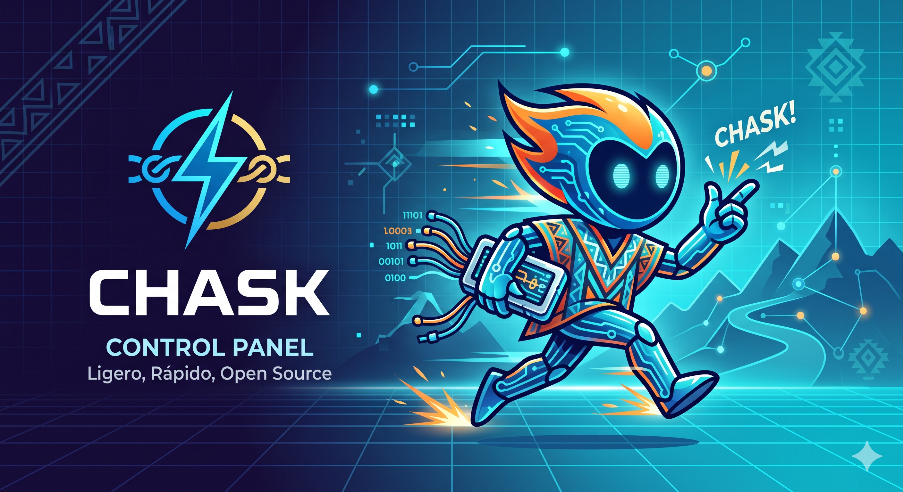

# Chask — Brand & Design Guidelines

## Name

**Chask** — from Quechua "Chasqui" (Inca messenger) + onomatopoeia of a snap/click (speed).

## Mascot: Quip

Quip is a digital Chasqui runner — a fusion of Andean culture and modern tech.

- Body with circuit-board patterns mixed with Andean textile motifs
- Flame-like hair (speed, energy)
- Glowing eyes (digital, alive)
- Carries a Quipu (Inca data device) reimagined as a modern interface
- Always in motion — running, snapping, working

> Status: Conceptualizing. The image above is a first exploration.

## Icon: The Quipu-Rayo

The logo combines a lightning bolt (speed) with Quipu knots (data).

**Design principles:**
- Extreme minimalism — knots should be clean pixels/dots, not complex
- When combined with the lightning line, it should read as a modern data structure
- Must work at small sizes (favicon, 16x16)

## Color Palette

**Primary:** Vibrant cyan/turquoise — evokes "fiber optic speed"
**Secondary:** Deep navy/dark blue — backgrounds
**Accent:** Warm orange/amber — Quip's flame, success states
**Error:** Soft red — but always paired with Quip to soften frustration

## Quip in the UX

Quip appears at key moments only — never cluttering the interface.

### Loading States
No traditional spinners. When the panel is processing (installing a DB, creating a site), Quip runs at full speed with the Quipu glowing. Conveys that the software is actively working fast.

### Success ("The Snap")
When a task completes successfully, Quip does a finger snap and a digital wink. Satisfying visual feedback that reinforces the "chask" (snap) identity.

### Error States
If something fails, Quip appears with X-shaped eyes, stumbling slightly. Softens user frustration with personality instead of a cold error message.

### Idle
Quip does NOT appear on normal screens. The interface stays clean — sans-serif typography, generous whitespace, instant-loading components. Quip is a reward, not a decoration.

## UI Design Principles

- **Clean and light** — as lightweight as the software itself
- **Modern sans-serif typography** — Inter, system fonts
- **Generous whitespace** — let the interface breathe
- **Instant-loading components** — no heavy JS frameworks
- **Dark mode first** — matches the server/terminal aesthetic
- **Quip appears only for feedback** — loading, success, error. Never decorative.
